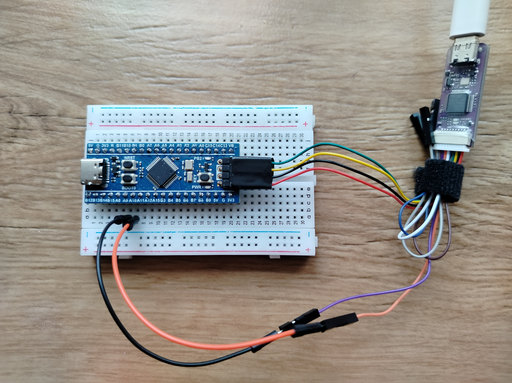

# STM32 debugging with UART in polling mode

*During code development for STM32 microcontrollers, it can be useful to display various test messages in a terminal window. However, this is not as simple as it may seem.*

## The problem

Sending messages to a screen in serial console is the simplest and most common way to debug embedded programs. In Arduino projects, using `Serial.print()` is a standard debugging technique.  

Unfortunately,  it's a bit more complicated thing for STM32 projects. Just adding a `printf()` line to your code might not be enough to get even basic printing functionality. Here are some tips to help you get working serial debugging console.

## How it works
There is no direct connection between a STM32 board and a PC, so we need to use a middleman device such as ST-Link debugger/programmer. We will connect the board to the debugger using the SWD interface and the UART simultaneously. The SWD interface will be used for code updates, and the UART for sending messages.

The debugger will send a message to the PC via USB. The data is then sent to a virtual COM port on the debugger, and finally, a terminal program like PuTTY communicates with that virtual COM and displays the data on the console.

We will try to work with the UART in its simplest polling mode, where the MCU must continuously read the UART line to transmit data.

## What is needed

- **STM32 development board** from the Black Pill or Nucleo series can be used. The [WeActStudio BluePill Plus](https://github.com/WeActStudio/BluePill-Plus) board is a good choice. It's an improved version of the popular Blue Pill board, featuring a genuine STM32F103C8T6 chip.
  
- **ST-Link debugger** / programmer board, original or compatible. [WeActStudio MiniDebugger](https://github.com/WeActStudio/WeActStudio.MiniDebugger) is recommended for use with the BluePill Plus board. It is compatible with the original ST-Link and has both SWD and UART interfaces.

- **Jumper wires** - 6 pieces in total may be needed, 4 for the SWD and 2 for the UART connection. The amount and type of wire used depends on the board you have. For the BluePill Plus board, installed on the breadboard and connected to the MiniDebugger (as shown in the picture), you need two 10-cm-long male-to-male jumper wires for UART connection. For the Nucleo board, there are no wires needed, as all the connections are made inside the board.

- **USB Type-C cable** is needed to connect the debugger to a PC. Choose the cable's length according to your needs.

## How to connect it

- Connect SWD connector of the STM32 board to the corresponding wires of the debugger.
- Connect UART1_TX (pin PA9 of the chip and pin A9 for the Blue Pill Plus board) to the RXD pin of the debugger.
- Connect USART1_RX (pin PA10 of the chip and pin A10 for the BluePill Plus board) to the TXD pin of the debugger.

## What about software setup

- **STM32 toolchain** like STM32CubeIDE or Keil has to be installed.
- **Terminal Program** as PuTTY, CoolTerm, TeraTerm or any other of your choice.
- **Virtual COM Port** driver should be installed when connecting a debugger.

For every project do the following:

1. Run the code in STM32CubeIDE.  
2. Run PuTTY and specify the COM-port as it is shown in Windows Device Manager - you should see something like "STMicroelectronics STLink Virtual COM Port (COMx)" there. The port's speed should be set to the value specified by thr Device Configuration Tool in STM32CubeIDE, which is 115200 by default.
3. You should see the messages printed in the PuTTY terminal. 

## What does the code do

> [!WARNING]
> Turn on the SWD interface when configuring the board, otherwise you won't be able to flash firmware the next time. In STM32CubeIDE, this means setting Serial Wire mode in the Debug settings (refer to .ioc file of the project).

1. **bluepill-plus_uart_transmit**

We'll start with the simplest code. Put the lovely "Hello, World!" string into an uint8_t array.  The function `HAL_UART_Transmit` then reads the string and sends it to UART1 in an endless cycle. 

You will see a "Hello, World!" message printed every second in the console.

> [!TIP]  
> Terminate a string with a '\r\n' sequence to print it with the very beginning of the new line.  

---

2. **bluepill-plus_uart_putchar**  

This time we'll use `printf` and include stdio.h in our main.c.  In STM32Cube projects, `printf` is redirected to the `_write` function defined in nearby syscall.c file. This `_write` function in turn contains `__io_putchar`function which is explicitly determined in main.c. Thus defined `__io_putchar` function utilizes `HAL_UART_Transmit` function for sending data via UART. Thus this code will be redirect the output of the printf function to the USART1 interface of STM32. 

You will see the same "Hello, World!" message printed every second in the console.

> [!IMPORTANT]  
> Terminate a string to be printed with a '\n' otherwise the`_write` function will not be called! Without this, the string will be added to an internal buffer and not printed. To start output from the beginning of a new line, use '\r' before '\n'.

> [!TIP]
> There is actually no need to use the PUTCHAR_PROTOTYPE, as it is often used in a lot of examples. The `__ io_putchar` function has already been declared in the library.
---

3. **bluepill-plus_uart_write**

On some systems, it is not enough to overwrite `__io_putchar` if the syscalls.c file is missing or has not been implemented. In such cases, the entire `_write` function should be overwritten. Instead of printing a string, we will display the time in seconds elapsed since the program's start.  

Now you should see a "Time counter: x sec" message printed every second in the console.

---

> [!NOTE]
> For further explanations, see comments in the `main.c` file of each project. The device configuration for each project has also been made for relevant peripherals and other pins. See the `.ioc` files for references.

## References

1. https://www.st.com/resource/en/application_note/dm00354244-stm32-microcontroller-debug-toolbox-stmicroelectronics.pdf
2. https://wiki.st.com/stm32mcu/wiki/Getting_started_with_UART
3. https://wiki.st.com/stm32mcu/wiki/STM32StepByStep:Step3_Introduction_to_the_UART

